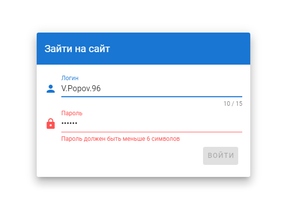
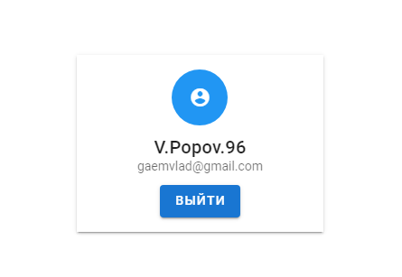

# Авторизация пользователя на Nuxt.js 

Шаги, чтобы подготовить приложение:
  1. Скачайте архив;
  2. Распакуйте его на вашем компьютере;
  3. Откройте содержимое папки с помошью текстового редактора (VS Code, WebStorm или любого другого на Ваш выбор)
  4. С помощью терминала войдите в папку, введя команду 
  ```
  $ cd login-nuxt
  ```
  5. После этого, чтобы установить компоненты для правильной работы приложения также в терминале введите команду 
  ```
  $ npm install
  ```
Для того, чтобы открыть окно авторизации в **режиме разработки** используйте команду 
```
$ npm run dev
```
Когда Nuxt выполнит свою работу перейдите по [ссылке](http://localhost:3000) и можете выполнить вход на сайт.

Для запуска сборки в **режиме продакшена** и запуска сервера используйте:
```
$ npm run build
$ npm start
```

Пример авторзации пользователя:


Если возникли сложности, пишите на почту: **Gaemvlad@gmail.com**
